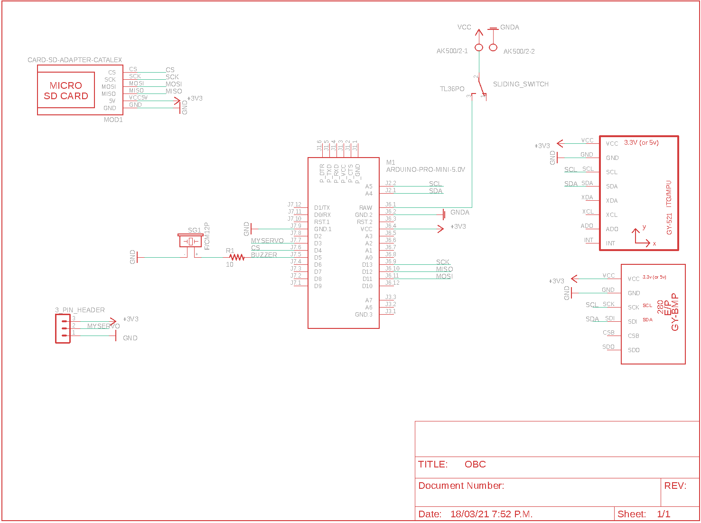
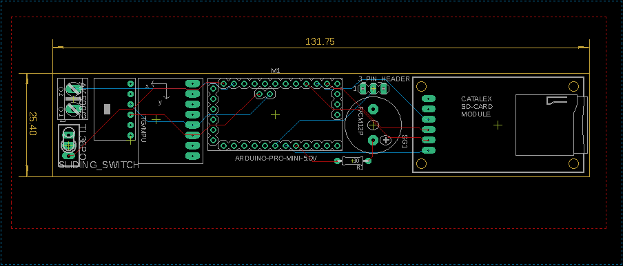

# Pillar of Autumn OBC

The purpose of this project is to give the knowledge and open source code on how to build a flight computer (On Board Computer (OBC)) for an amateur model rocket for research and science projects.

The Arduino code is in the *OBC directory*, and it's divided in subfiles for ease of use. To run it you have to compile de **OBC.ino** file.

## What i does?
Is a simple data logger that stores the values of the sensors in a CSV file for further analysis. Is also activate a servo motor when detects free fall for a parachute deployment mechanism.

*POA is an achronym of "Pillar Of Autumn", the coolest spaceship of Halo Reach*

## How it stores data?
The method for storing info is in the *logData.ino* file. The order in wich is save is:
1. logTime: time passed since it's turn on
2. Relative altitude.
3. Free fall state: 0 or 1
4. BMP280 temperature
5. Pressure
6. Pitch
7. Roll
8. Yaw
9. X Acceleration
10. Y Acceleration
11. Z Acceleration

### Libraries
For running this project, you will have to download some libraries for arduino :
* [SdFat](https://github.com/greiman/SdFat) - by Bill Greiman
* [MPU6050](https://github.com/jarzebski/Arduino-MPU6050) - by Korneliusz Jarzebski (improved version [here](https://github.com/el-NASA/Arduino-MPU6050))
* [BMP280](https://github.com/adafruit/Adafruit_BMP280_Library) - by Adafruit (if you use a chinese version you should change the I2C address from 0x77 to 0x76)

## Schematics and PCB design
The **OBC** use the MPU6050 and BMP280 Sensors, a micro SD module and a buzzer for alerts. It also has the capability to activate a servo motor when it dectects free fall.

I hope that the information in this repository is a good starting point for your science and technology projects, If you want to help us developing this, feel free to do it.

## References
* Calamac Projects (2015). “Arduino Rocket Data Logger”. Instructables.com. Recuperado de: https://www.instructables.com/id/Arduino-Rocket-Data-Logger
* Boyarizo E. y Méndez C. (2017). Diseño y construcción de un microsatélite(CanSat). IES El Burgo de Las Rozas.
* Day B., Lumpkin T., Huegele V., Pierce C. (Sin fecha). “Basics of rocketry”. Huntsville Area Rocketry Assiciation (HARA).
* Newton M. (2012). Rocket Anatomy 101. NAR.
* Orlando J. (2012). “Estudio de la trayectoria de un cohete de tres etapas lanzado desde el territorio colombiano”. Universidad Nacional de Colombia, Bogotá. Pag. 80-81.
* T. Benson (2014). Brief History of Rockets. NASA. Recuperado de : https://www.grc.nasa.gov/www/k-12/TRC/Rockets/history_of_rockets.html
* Van Milligan T. (2009) “Make a rocket payload bay”. Apogee Rockets. Recuperado de : https://www.youtube.com/watch?v=_ctUCO8GsJ4&index=30&list=PLnX-NFLCOOVkq82xIrfm6KuaVoljTCtob
* Van Milligan T. (Sin fecha). “Pressure Relief Holes”. Apogee preak of flight newsletter, issue 68.

### Bibliography
* Álvarez N., Huérfano R., Ojeda O., (2015) “Diseño e implementación de misión para el lanzamiento de un cohete para tres kilómetros de altura”. Universidad Nacional de Colombia, Bogotá.
* Esero (sin fecha). “2018 UK Cansat Competition Guidelines”. Esero. Pag. 9-10.
* European Space Agency(ESA) (2018). “CanSat Guidelines 2018-109”. ESA.
* Ojeda O. (2016) “The Aerospace development and research group of the Universidad Nacional de Colombia, GIDA-UN. A tool for aerospace education in Colombia”. 67 th International Astronautical Congress (IAC). México, Guadalajara.
* Ricardo P. (2018). “Reto de innovación IEEE 2018 – CanSat para la paz”. Universidad Distrital. Bogotá. Recuperado de : https://ieee.udistrital.edu.co/ieee-innovation-2018/
